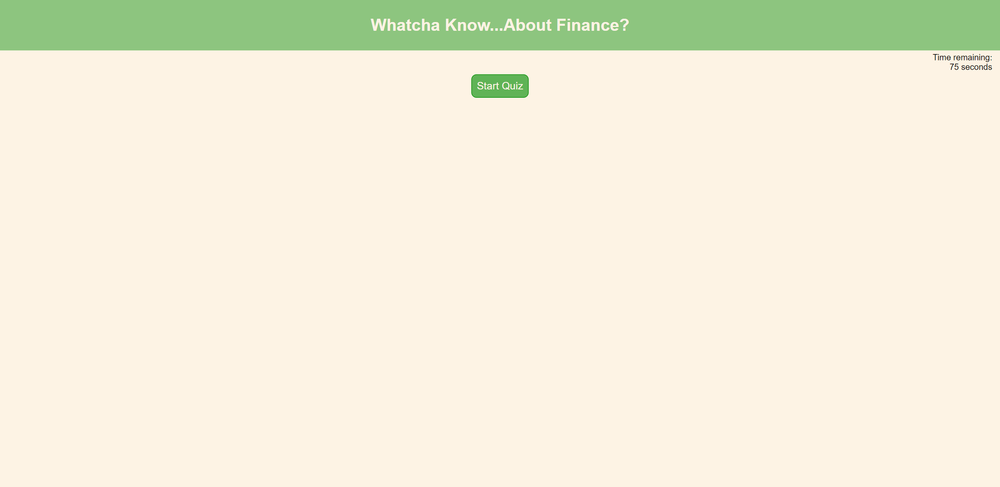
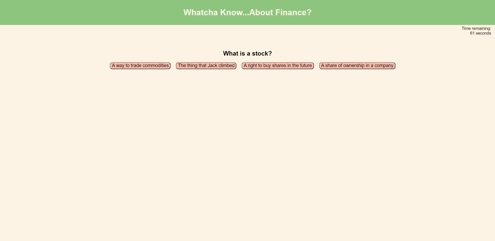

# Financial Quiz

## Description

Welcome to a fabulous, fantastical financial quiz! Here you will find a set of questions that test on some financial terms and financial history. Try, if you will, your best to guess at the right answer and find out your score at the end!

For each correct answer, 10 points you get. For each wrong, however, lose 5 points and 10 seconds from the time allowed. At the end, each second left will be a point to your final score. 

## Link to the Quiz

[Click here to access the Financial Quiz](https://mradamhorn.github.io/code-quiz/index.html)

## Screenshot of the Quiz Webpage

